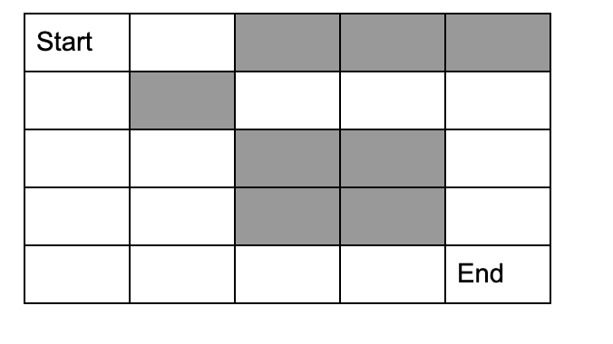
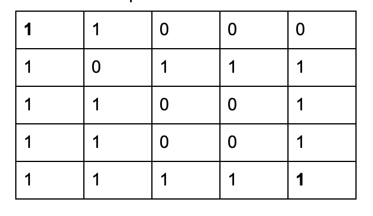
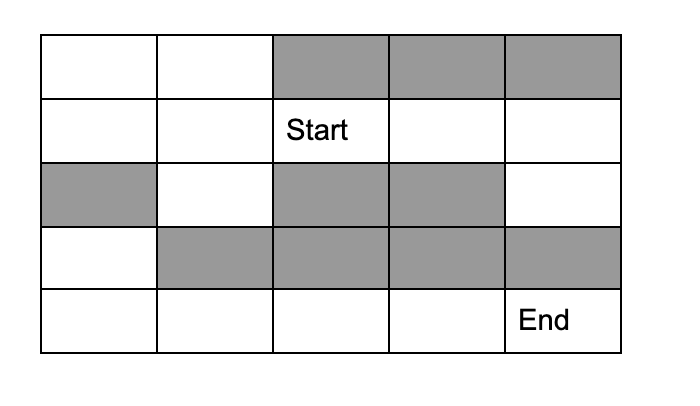
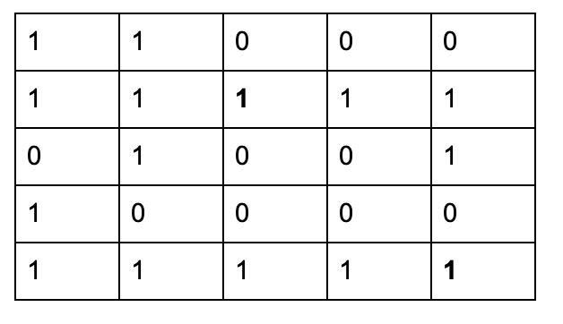

# HW5 EE599 - Computing Principles for Electrical Engineers

- Deadline: No deadline
- Total: 120 points. 100 points is considered full credit.

**About Grading Rubrics**
- For non-coding questions, you will find **Answer** below each question. Please write your answer there.
- For coding questions, please make sure that your code can run ```bazel run/test```. In this homework, you will need to fill up [cpplib.cc](src/lib/cpplib.cc) and tests in [tests](tests). Do **Not** change or modify any given function headers and formats in both [cpplib.cc](src/lib/cpplib.cc) and tests in [tests](tests). Unexpected changes will result in **zero** credit.
- For coding questions, there is a **black box testing** for each question. All points are only based on passing the test cases or not (i.e. we don't grade your work by your source code). So, try to do comprehensive testing before your final submission.

## Question 1 (20 Points. Easy)

Given a vector of distinct integer digits (i.e. 0 to 9), convert the vector to an **integer** value called **result** that represents the vector. The output **result** is created by concatenating the vector elements to each other and converting it to a number.

Example:\
Input: [1, 2, 3], output: 123\
Input: [0, 3, 2], output: 32\
Input: [1, 9, 9, 0], output: 1990

Write several tests using GTest for your function in [tests/q1_student_test.cc](tests/q1_student_test.cc).

Please create your test cases and run the following command to verify the functionality of your program.
```
bazel test tests:q1_student_test
```

## Question 2 (40 Points. Easy)

Given a vector of **distinct** digits (i.e. 0 to 9) and a value k, find all permutations that satisfy the following:
- If we convert the permutation to a number **result** (as in the ConvertToNumber in the previous question), then result >= k.

Example :\
input:  [1, 2, 3], k = 150 \
output:\
[\
  [2, 1, 3],\
  [2, 3, 1],\
  [3, 1, 2],\
  [3, 2, 1]\
]\
Explanation: [1, 2, 3], [1, 3, 2] are not included in the output because 123 < 150 and 132 < 150.

Please use early backtracking. 


Write several tests using GTest for your function in [tests/q2_student_test.cc](tests/q2_student_test.cc).

Please create your test cases and run the following command to verify the functionality of your program.
```
bazel test tests:q2_student_test
```

## Question 3 (40 Points. Easy)

Suppose we have the following map from a digit (represented as a character) to a set of characters:\
std::map<char, std::set<char>> m =\
{\
    {'0', {'a', 'b'}},\
  {'1', {'d', 'f'}},\
  {'2', {'g', 'h'}},\
  {'3', {'j', 'k'}},\
  {'4', {'m', 'n'}},\
  {'5', {'p', 'q'}},\
  {'6', {'t', 'u'}},\
  {'7', {'w', 'x'}},\
  {'8', {'!', '?'}},\
  {'9', {'*', '#'}},\
};
  
**1.** Assuming the above map is given to you as a global variable, return a **vector** of all possible **strings** that a given string of digits in can represent.\
**2.** What is the worst case runtime and why?

**Example1:**\
in: "34"\
out: { "jm", "jn", "km", "kn" }


**Example2:**\
in: "345"\
out: { "jmp", "jmq", "jnp", "jnq", "kmp", "kmq", "knp", "knq" }


Write several tests using GTest for your function in [tests/q3student_test.cc](tests/q3_student_test.cc).

Please create your test cases and run the following command to verify the functionality of your program.
```
bazel test tests:q3_student_test
```

## Question 4 (20 Points. Medium)

You are given a maze, a start and an end point, find out if there is at least one path from start to end. 
  * The maze is a grid where some cells are blocked and you cannot go there.
  * You can only move to the right, left, down, or up. You cannot move diagonally. 
  * The maze is represented by a 2x2 vector where a 0 represents a blocked and 1 represents a free cell.
  * Start and End are specified as pairs: (i,j), where i is the row, and j is the column.
  * Notice that you don’t need to generate the path. Just find out if at least one path exists.

**Example 1:**

<p align="left"></p>

The maze is represented as a 2x2 vector called **maze** as follows:

<p align="left"></p>

**Input:** 2x2 maze (as shown above), start=(0,0), end=(4,4)\
**Output:** true (because there is a path from cell (0,0) to (4,4)

**Example 2:**


<p align="left"></p>

The maze is represented as a 2x2 vector called **maze** as follows:


<p align="left"></p>

**Input:** 2x2 maze (as shown above), start=(1,2), end=(4,4)\
**Output:** false (because there is no path from cell (1,2) to (4,4)

Write several tests using GTest for your function in [tests/q4student_test.cc](tests/q4_student_test.cc).

Please create your test cases and run the following command to verify the functionality of your program.
```
bazel test tests:q4_student_test
```

## Optional Questions (No Credit)

1.Find all permutations of a given list of digits (might have duplicates).

Example :\
input:  [1, 1, 3]\
output:\
[[1, 1, 3], [1, 3, 1], [3, 1, 1]]

2.Given a non-empty string s and a dictionary containing a list of words,  add spaces in s to construct a sentence where each word is a valid dictionary word. Return all such possible sentences.

Example :\
Input: s = "catsanddog”,  dic = ["cat", "cats", "and", "sand", "dog"]\
Output: ["cats and dog", "cat sand dog"]


